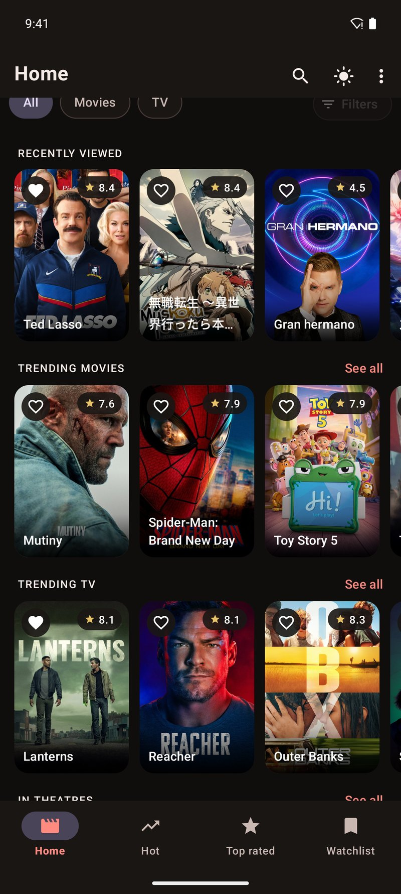
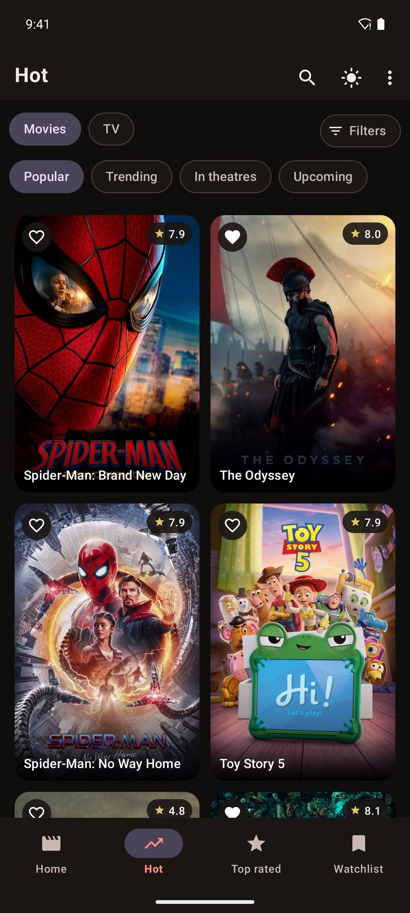
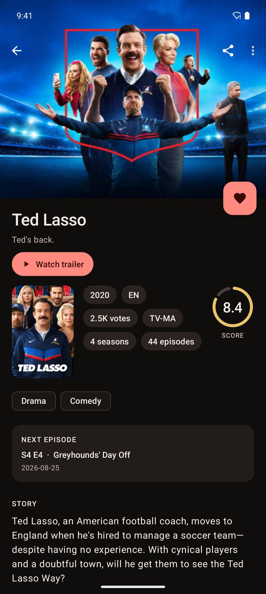
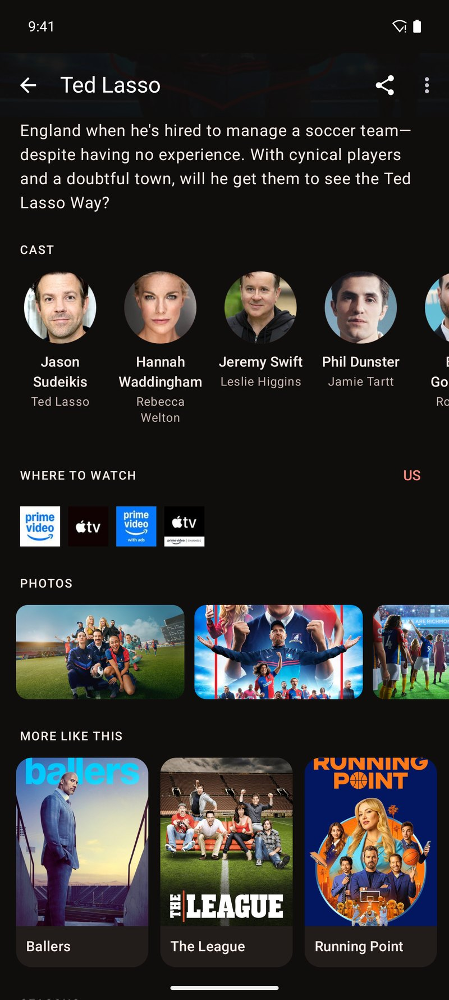
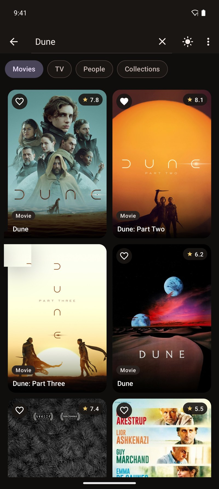
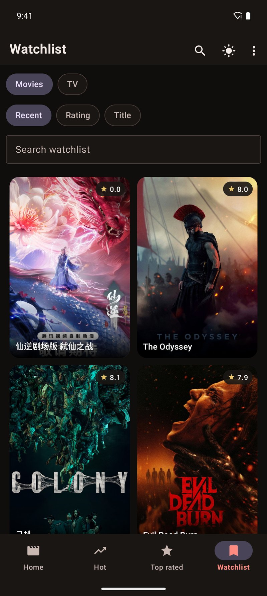

# Cinestine

<p align="center">
  <strong>Discover movies and TV shows. Save what you want to watch next.</strong><br/>
  Browse trending titles, search people and collections, see where something streams, and keep a local watchlist.
</p>

<p align="center">
  <a href="https://play.google.com/store/apps/details?id=comnikhil_31.httpsgithub.cinestine&hl=en"></a>
</p>

<p align="center">
  
  
  
</p>
<p align="center">
  
  
  
</p>

Catalog data is provided by [The Movie Database (TMDB)](https://www.themoviedb.org/). Cinestine is not endorsed or certified by TMDB.

## Features

**Home** — Recently viewed plus trending movies, trending TV, and in-theatres rails. Switch All / Movies / TV, or open Filters for genre, year, and score.

**Hot & Top rated** — Full poster grids for popular, trending, in theatres, upcoming, airing today, and on the air. Heart any title without leaving the list.

**Search** — Movies, TV shows, people, and collections, with live results as you type.

**Title details** — Backdrop, score, genres, story, trailers, seasons and episodes, cast, photos, similar titles, and region-aware “where to watch.” Share a TMDB link from the toolbar.

**Watchlist** — Saved on-device with Room. Filter movies or TV, sort by recent, rating, or title, and search within the list.

**Preferences** — Light, dark, or system theme, and a watch region for certifications and streaming providers.

## Getting started

You need Android Studio with JDK 17, a device or emulator on API 24+, and a [TMDB API key](https://developer.themoviedb.org/docs/getting-started).

1. Clone the repository and open it in Android Studio.
2. Add your key to `local.properties` (gitignored):

   ```properties
   sdk.dir=/path/to/Android/sdk
   tmdb.api.key=YOUR_TMDB_API_KEY
   ```

3. Sync Gradle and run the **debug** variant.

The key is compiled into `BuildConfig`. HTTP logging is debug-only and never includes the API key.

## Architecture

MVVM, with one repository between the UI and TMDB / Room.

```
app/src/main/java/nikhil/cinestine/
├── CinestineApp.kt     Application graph: OkHttp, Retrofit, Room, analytics
├── analytics/          Firebase Analytics events
├── data/               MovieRepository, TMDB API, Room
├── model/              Shared models
└── ui/                 Screens by feature
```

Main navigation is a four-tab pager: **Home**, **Hot**, **Top rated**, and **Watchlist**. Details, person, collection, episode, and discover each open in their own activity.

| | |
| --- | --- |
| Language | Kotlin 2.2 |
| UI | Material 3, View Binding, ViewPager2 |
| Async | Coroutines and Flow |
| Network | Retrofit, OkHttp, kotlinx.serialization |
| Images | Coil |
| Storage | Room |
| Analytics | Firebase Analytics and Crashlytics |
| SDK | min 24, compile/target 36 |

## Attribution

This product uses the TMDB API but is not endorsed or certified by [TMDB](https://www.themoviedb.org/).

## License

```
Copyright 2016–2026 Nikhil Bhaskar

Licensed under the Apache License, Version 2.0 (the "License");
you may not use this file except in compliance with the License.
You may obtain a copy of the License at

    http://www.apache.org/licenses/LICENSE-2.0

Unless required by applicable law or agreed to in writing, software
distributed under the License is distributed on an "AS IS" BASIS,
WITHOUT WARRANTIES OR CONDITIONS OF ANY KIND, either express or implied.
See the License for the specific language governing permissions and
limitations under the License.
```
